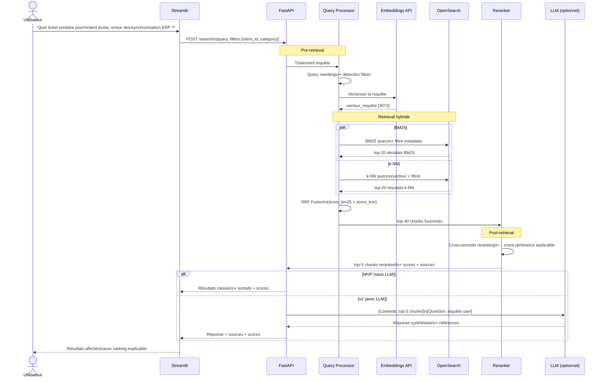
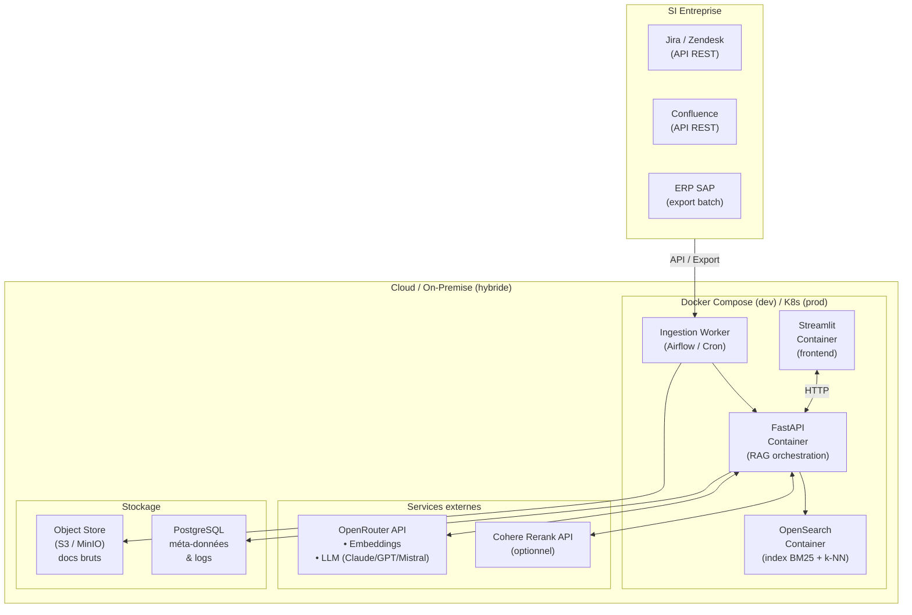

# Architecture RAG d'entreprise — v1
## Dataset : Customer Support Tickets (200 000 tickets — 30 colonnes — 6 langues — 10 produits — 3 ans)

> **Source données** : `data/raw/customer_support_tickets_200k.csv` — Analyse EDA complète : `eda_rapport.md`

> **Rendu en Mermaid** — se visualise directement dans VS Code (extension Markdown Preview Mermaid Support), GitHub, ou [mermaid.live](https://mermaid.live)

---

## Vue d'ensemble — Architecture complète

```mermaid
flowchart TB
    %% ─────────────────────────────────────────
    %% COUCHE 0 : SOURCES DE DONNÉES
    %% ─────────────────────────────────────────
    subgraph SOURCES[" Sources de données (SI existant)"]
        direction TB
        TICKET["CSV / Ticketing\n200 000 tickets\n10 catégories · 10 produits\n6 langues (FR/EN/DE/ES/JA/ZH)\n6 régions mondiales"]
        ERP[" ERP\nSAP / Odoo\n(commandes, produits,\ncontrats)"]
        CRM[" CRM\nSalesforce / HubSpot\n(clients, interlocuteurs,\nopportunités)"]
        PIM[" PIM\nAkeneo\n(fiches produits,\nattributs techniques)"]
        GED[" GED / Doc\nSharePoint / Confluence\n(PDFs, wikis,\ndocumentation technique)"]
    end

    %% ─────────────────────────────────────────
    %% COUCHE 1 : PIPELINE D'INGESTION
    %% ─────────────────────────────────────────
    subgraph INGESTION[" Pipeline d'ingestion"]
        direction TB
        CONNECT[" Connecteurs\n(API REST, webhooks,\nexports CSV/JSON,\nAirbyte / n8n)"]
        PREPROC[" Pré-traitement\n• Suppression PII\n  (customer_name, customer_email)\n• Normalisation unicode\n• Déduplication (hash ticket_id)\n• Extraction métadonnées\n  (product, category, priority,\n   status, channel, region,\n   language, os, subscription,\n   segment, escalated, sla_breached,\n   created_date, resolved_date)"]
        CHUNK[" 1 ticket = 1 chunk\n• Taille réelle : 80–120 tokens\n  (description + resolution_notes)\n• Pas de segmentation requise\n• Format :\n  title: {product} — {category}\n  Issue: {issue_description}\n  Resolution: {resolution_notes}\n• Métadonnées héritées (13 champs)"]
    end

    %% ─────────────────────────────────────────
    %% COUCHE 2 : MODÈLES D'EMBEDDINGS
    %% ─────────────────────────────────────────
    subgraph EMBED_SVC[" Service d'embeddings"]
        direction LR
        EMBED_API[" Via OpenRouter API\n• BGE-M3 (recommande — 6 langues)\n• text-embedding-3-large\n• Cohere embed-v3"]
        EMBED_LOCAL[" Modèle local (recommande prod)\n• BGE-M3 (1024 dims, 8192 tok)\n• e5-multilingual-large\n• nomic-embed-text"]
    end

    %% ─────────────────────────────────────────
    %% COUCHE 3 : INDEX (OPENSEARCH)
    %% ─────────────────────────────────────────
    subgraph INDEX[" Couche d'indexation — OpenSearch"]
        direction LR
        BM25[" Index Full-Text (BM25)\n• Analyzer : icu_analyzer (multilingue)\n  (FR/EN/DE/ES/JA/ZH)\n• Champs texte :\n  content, issue_description,\n  resolution_notes\n• Filtres keyword :\n  product, category, priority,\n  status, channel, region,\n  language, os, sla_breached,\n  escalated, subscription_type,\n  customer_segment\n• Filtre date : created_date"]
        KNNIDX[" Index Vectoriel (k-NN / HNSW)\n• BGE-M3 : 1024 dims\n• Similarité cosinus\n• engine : lucene\n• m=16, ef_construction=128\n• 200 000 vecteurs (~800 Mo RAM)"]
    end

    %% ─────────────────────────────────────────
    %% COUCHE 4 : RECHERCHE & RANKING
    %% ─────────────────────────────────────────
    subgraph SEARCH[" Couche de recherche & ranking"]
        direction TB
        QREWRITE[" Query Processing\n• Query rewriting\n• HyDE (Hypothetical\n  Document Embeddings)\n• Expansion de requête"]
        HYBRID[" Hybrid Search (RRF)\n• BM25 score ⊕ Vector score\n• RRF rank_constant=60\n• Filtres disponibles :\n  product · category · priority\n  status · channel · region\n  language · os · escalated\n  sla_breached · subscription\n  customer_segment · date_range"]
        RERANK[" Re-ranking\n• Cross-encoder\n• Cohere Rerank\n• Score de pertinence\n  explicable"]
    end

    %% ─────────────────────────────────────────
    %% COUCHE 5 : LLM (GÉNÉRATION)
    %% ─────────────────────────────────────────
    subgraph LLM_SVC[" Service LLM — OpenRouter"]
        direction LR
        LLM[" Génération / Reformulation\n(optionnel — couche v2)\n• Claude 3.5 / GPT-4o\n• Mistral Large\n• Llama 3.3\nPrompt = Contexte chunks\n+ Question utilisateur"]
    end

    %% ─────────────────────────────────────────
    %% COUCHE 6 : API BACKEND
    %% ─────────────────────────────────────────
    subgraph BACKEND[" Backend RAG"]
        direction LR
        API[" API REST\n(FastAPI / Python)\n• /search endpoint\n• Gestion auth (JWT)\n• Logging & tracing\n• Rate limiting"]
    end

    %% ─────────────────────────────────────────
    %% COUCHE 7 : FRONTEND
    %% ─────────────────────────────────────────
    subgraph FRONTEND[" Frontend utilisateur"]
        direction LR
        UI[" Interface de recherche\n(Streamlit MVP)\n• Barre de recherche libre\n• Filtres : product · category\n  priority · status · channel\n  region · language · os\n  subscription · segment\n• Résultats classés (score)\n• Affichage :\n  Issue + Resolution + métadatas\n• Lien ticket source (ticket_id)"]
    end

    %% ─────────────────────────────────────────
    %% COUCHE 8 : ÉVALUATION
    %% ─────────────────────────────────────────
    subgraph EVAL[" Évaluation du système"]
        direction LR
        METRICS[" Métriques\n• Precision@k, Recall@k\n• NDCG, MRR\n• Faithfulness\n• Answer Relevance\n• Context Relevance"]
        JUDGE[" LLM-as-Judge\n(RAGAs / TruLens)\n• Génération Q&A synthétique\n• Scoring automatique"]
    end

    %% ─────────────────────────────────────────
    %% FLUX PRINCIPAL (INGESTION)
    %% ─────────────────────────────────────────
    SOURCES --> CONNECT
    CONNECT --> PREPROC
    PREPROC --> CHUNK
    CHUNK --> EMBED_SVC
    EMBED_SVC --> KNNIDX
    CHUNK --> BM25

    %% ─────────────────────────────────────────
    %% FLUX PRINCIPAL (QUERY TIME)
    %% ─────────────────────────────────────────
    UI -->|"requête utilisateur"| API
    API --> QREWRITE
    QREWRITE -->|"requête vectorisée"| EMBED_SVC
    QREWRITE --> HYBRID
    EMBED_SVC -->|"vecteur requête"| HYBRID
    BM25 -->|"résultats BM25"| HYBRID
    KNNIDX -->|"résultats k-NN"| HYBRID
    HYBRID --> RERANK
    RERANK -->|"top-k chunks"| LLM
    RERANK -->|"résultats classés\n(MVP sans LLM)"| API
    LLM -->|"réponse générée\n(v2 optionnel)"| API
    API -->|"résultats + scores"| UI

    %% ─────────────────────────────────────────
    %% ÉVALUATION
    %% ─────────────────────────────────────────
    RERANK -.->|"logs retrieval"| METRICS
    LLM -.->|"logs génération"| JUDGE
    METRICS -.-> JUDGE

    %% ─────────────────────────────────────────
    %% STYLES
    %% ─────────────────────────────────────────
    classDef source fill:#dbeafe,stroke:#2563eb,color:#1e3a5f
    classDef ingestion fill:#fef9c3,stroke:#ca8a04,color:#713f12
    classDef index fill:#dcfce7,stroke:#16a34a,color:#14532d
    classDef search fill:#fce7f3,stroke:#be185d,color:#831843
    classDef llm fill:#ede9fe,stroke:#7c3aed,color:#3b0764
    classDef backend fill:#f1f5f9,stroke:#475569,color:#1e293b
    classDef frontend fill:#fff7ed,stroke:#ea580c,color:#7c2d12
    classDef eval fill:#f0fdf4,stroke:#4ade80,color:#166534
    classDef embed fill:#fdf4ff,stroke:#a855f7,color:#581c87

    class TICKET,ERP,CRM,PIM,GED source
    class CONNECT,PREPROC,CHUNK ingestion
    class BM25,KNNIDX index
    class QREWRITE,HYBRID,RERANK search
    class LLM llm
    class API backend
    class UI frontend
    class METRICS,JUDGE eval
    class EMBED_API,EMBED_LOCAL embed
```



---

## Vue détaillée — Pipeline d'ingestion

```mermaid
flowchart LR
    subgraph RAW["Données brutes — customer_support_tickets_200k.csv"]
        T1["200 000 tickets · 30 colonnes\n{ticket_id, product, category,\n issue_description, resolution_notes,\n priority, status, channel, region,\n language, operating_system,\n subscription_type, customer_segment,\n escalated, sla_breached,\n first_response_time_hours,\n resolution_time_hours,\n customer_satisfaction_score,\n issue_complexity_score,\n ticket_created_date, ticket_resolved_date,\n customer_name(*PII), customer_email(*PII),\n customer_age, customer_gender,\n customer_tenure_months, previous_tickets,\n browser, payment_method,\n preferred_contact_time}"]        
    end

    subgraph CLEAN["Nettoyage"]
        C1["Suppression PII\n(customer_name → anonymise,\n customer_email → supprime)"]
        C2["Normalisation unicode (icu)\n6 langues : FR/EN/DE/ES/JA/ZH"]
        C3["Déduplication (ticket_id)"]
        C4["Filtrage statut :\nseulement Resolved/Closed\npour la base de résolutions"]
    end

    subgraph META["Extraction métadonnées (13 champs)"]
        M1["product · category · priority\nstatus · channel · region\nlanguage · operating_system\nsubscription_type · customer_segment\nescalated · sla_breached\nticket_created_date"]
    end

    subgraph CHUNKING["Structuration chunk (1 ticket = 1 chunk)"]
        CH1["Format du chunk :\ntitle: {product} — {category}\nIssue: {issue_description}\nResolution: {resolution_notes}"]
        CH2["Taille reelle : 80–120 tokens\n(pas de split necessaire)\nCorpus total : ~200k chunks"]
        CH3["Chunk hérite des 13 métadonnées\n+ is_current: true\n+ doc_version: ticket_id"]
    end

    subgraph EMBEDDING["Vectorisation (multilingual)"]
        E1["BGE-M3 (recommande)\n→ vecteur 1024 dims\n(100+ langues, 8192 tokens)"]
        E2["Normalisation L2\n(cosinesimil ready)"]
    end

    subgraph STORE["Stockage OpenSearch"]
        S1["Index dual-mapping :\n• field 'content' → text (icu_analyzer)\n• field 'embedding' → knn_vector\n  (1024 dims, cosinesimil, HNSW)\n• 13 fields keyword/date\n• Volume : 200k docs, ~800 Mo"]
        S2["Document store :\nchamp 'raw' complet\npour affichage (ticket original)"]
    end

    RAW --> CLEAN
    CLEAN --> C1 --> C2 --> C3 --> C4
    C4 --> META
    C4 --> CHUNKING
    META --> CH3
    CHUNKING --> CH1 --> CH2 --> CH3
    CH3 --> EMBEDDING
    EMBEDDING --> E1 --> E2
    E2 --> STORE
    CH3 -->|"texte brut"| S1
    E2 -->|"vecteur"| S1
    C4 -->|"doc original"| S2
```



---

## Vue détaillée — Pipeline de recherche (Query Time)



---

## Déploiement — Vue infrastructure



---

## Dataset — Statistiques clés (EDA)

| Dimension | Détail |
|-----------|--------|
| **Volume** | 200 000 tickets · 30 colonnes |
| **Période** | 2022-01-01 → 2024-12-31 (3 ans) |
| **Produits** | 10 (Billing, CRM, E-commerce, Cloud, Mobile, Analytics, Web Portal, Payment, Subscription, API) |
| **Catégories** | 10 (Feature Request, Bug Report, Login, Payment, Security, Performance, Refund, Data Sync, Subscription Cancel, Account Suspension) |
| **Langues** | 6 : French, English, German, Spanish, Japanese, Chinese (~33k chacune) |
| **Régions** | 6 : Africa, Asia, South America, Europe, North America, Australia (~33k chacune) |
| **OS clients** | 5 : Android, iOS, Linux, MacOS, Windows (~40k chacun) |
| **Canaux** | 5 : Web Form, Chat, Phone, Social Media, Email (~40k chacun) |
| **Taux escalade** | 50 % |
| **Taux SLA breach** | 50 % |
| **CSAT moyen** | 3,0 / 10 |
| **Temps résolution médian** | 120 h (~5 jours) |
| **Complexité moyenne** | 5,5 / 10 |
| **Taille chunk** | ~80–120 tokens / ticket → 1 ticket = 1 chunk |
| **Champs PII à exclure** | `customer_name`, `customer_email` |
| **Champs filtrage RAG** | `product`, `category`, `priority`, `status`, `channel`, `region`, `language`, `operating_system`, `subscription_type`, `customer_segment`, `escalated`, `sla_breached`, `ticket_created_date` |

## Mapping OpenSearch — Adapté au dataset

```json
{
  "settings": {
    "index": { "knn": true },
    "analysis": {
      "analyzer": {
        "multilingual": { "type": "icu_analyzer" }
      }
    }
  },
  "mappings": {
    "properties": {
      "content":             { "type": "text", "analyzer": "multilingual" },
      "issue_description":   { "type": "text", "analyzer": "multilingual" },
      "resolution_notes":    { "type": "text", "analyzer": "multilingual" },
      "embedding": {
        "type": "knn_vector",
        "dimension": 1024,
        "method": {
          "name": "hnsw", "space_type": "cosinesimil", "engine": "lucene",
          "parameters": { "m": 16, "ef_construction": 128 }
        }
      },
      "ticket_id":           { "type": "keyword" },
      "product":             { "type": "keyword" },
      "category":            { "type": "keyword" },
      "priority":            { "type": "keyword" },
      "status":              { "type": "keyword" },
      "channel":             { "type": "keyword" },
      "region":              { "type": "keyword" },
      "language":            { "type": "keyword" },
      "operating_system":    { "type": "keyword" },
      "subscription_type":   { "type": "keyword" },
      "customer_segment":    { "type": "keyword" },
      "escalated":           { "type": "keyword" },
      "sla_breached":        { "type": "keyword" },
      "ticket_created_date": { "type": "date" },
      "ticket_resolved_date":{ "type": "date" },
      "is_current":          { "type": "boolean" }
    }
  }
}
```

## Légende des composants

| Couche | Technologie choisie | Justification (EDA) |
|--------|--------------------|--------------------------|
| Source | CSV 200k tickets (30 colonnes) | Dataset synthétique équilibré, 6 langues, 10 produits |
| Pré-traitement | Python (pandas, re, hashlib) | Suppression PII (customer_name, customer_email), déduplication par ticket_id |
| Chunking | 1 ticket = 1 chunk (80–120 tokens) | Tickets courts : pas de split nécessaire. issue_description + resolution_notes concaténés. |
| Embeddings | BGE-M3 (1024 dims) | Seul modèle supportant les 6 langues du corpus (FR/EN/DE/ES/JA/ZH) avec contexte 8192 tokens |
| BM25 analyzer | OpenSearch icu_analyzer | Nécessaire pour le japonais et le chinois (tokenisation spécifique) |
| Index Full-Text | OpenSearch BM25 | Capture les codes d'erreur, noms de produits exacts |
| Index Vectoriel | OpenSearch k-NN HNSW (1024 dims) | 200k vecteurs ≈ 800 Mo RAM — dimensionné pour 1 nœud OpenSearch 4 Go |
| Filtres metadata | 13 champs keyword/date | product, category, priority, status, channel, region, language, os, subscription, segment, escalated, sla_breached, date |
| Fusion hybride | RRF (rank_constant=60) | Robuste à l'asymétrie BM25/cosine, pas de calibration manuelle |
| Re-ranking | bge-reranker-v2-m3 (multilingue) | Cohérent avec le modèle d'embedding BGE-M3, supporte les 6 langues |
| LLM (optionnel) | OpenRouter → Claude 3.5 / Mistral | Génération de résumés de résolution (v2). MVP = retrieval seul. |
| Orchestration | FastAPI (Python) | API REST, auth JWT, logging, rate limiting |
| Frontend MVP | Streamlit | 13 filtres sidebar, affichage issue+resolution+métadonnées, score de pertinence |
| Évaluation | RAGAs + LLM-as-Judge | CSAT inutilisable (uniforme à 3/10) → génération Q&A synthétique stratifiée par (category × product × language) |

---

## Notes architecturales — Décisions issues de l'EDA

### Décisions générales
- **Pas de LLM obligatoire en v1** : le MVP est un moteur de recherche à ranking explicable. Le LLM n'est qu'une option pour la v2.
- **OpenSearch** est choisi pour sa capacité native à combiner BM25 et k-NN dans le même index, évitant un second système vectoriel (Pinecone, Weaviate, etc.).
- **RRF** (Reciprocal Rank Fusion) est préféré à une simple somme pondérée de scores car il est plus robuste aux différences d'échelle entre BM25 et similarité cosinus.
- **OpenRouter** centralise l'accès aux modèles (embeddings + LLM) avec une seule clé API, simplifiant la gestion des dépendances.

### Décisions spécifiques au dataset (issues de l'EDA)
- **1 ticket = 1 chunk** : les descriptions et notes de résolution font en moyenne 80–120 tokens combinés. Aucune segmentation multi-chunks nécessaire. Cela simplifie l'ingestion et évite le problème de « chunk incomplet ».
- **BGE-M3 obligatoire** : le corpus est multilingue (6 langues dont japonais et chinois). Les modèles anglocentrés (text-embedding-ada-002) ou euro-centrisés sont insuffisants. BGE-M3 supporte 100+ langues avec un seul modèle.
- **icu_analyzer pour BM25** : les tickets en japonais et chinois nécessitent une tokenisation spécifique (pas d'espaces entre les mots). Le plugin ICU Analysis d'OpenSearch est obligatoire.
- **Issue + Resolution dans le même chunk** : l'EDA (wordcloud) montre que `issue_description` et `resolution_notes` ont des vocabulaires complémentaires. Les concaténer dans le chunk maximise le recall (une recherche sur le symptôme retrouve aussi les résolutions).
- **CSAT inutilisable comme signal** : le score de satisfaction est uniformément distribué à 3/10 (dataset synthétique). Ne pas l'utiliser pour le ranking. Utiliser `status = Resolved/Closed` + présence de `resolution_notes` comme proxy de résolution réussie.
- **Filtres metadata riches** : 13 champs keyword/date issus de l'EDA permettent un filtrage structuré précis (ex. : `product=Mobile App AND language=French AND category=Bug Report AND status=Resolved`).
- **Suppression PII** : `customer_name` et `customer_email` sont les seuls champs PII identifiés dans ce dataset. Les supprimer avant embedding. Les autres champs clients (âge, genre, ancienneté) sont conservés comme métadonnées agrégées (non inclus dans le texte du chunk).
- **Évaluation** : générer un jeu de test synthétique stratifié sur les 10 × 10 = 100 combinaisons (category × product) pour garantir la couverture. Viser au moins 5 Q&A par combinaison = 500 paires minimum.
